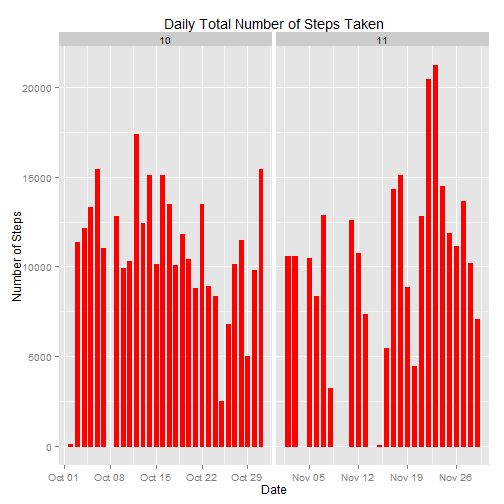
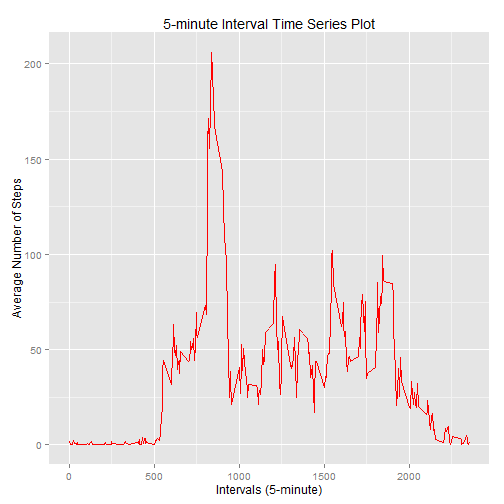
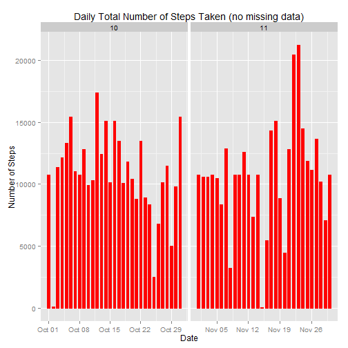

Reproducible Research: Peer Assessment 1
==========================================
Created by Daniel Erzse on November 16, 2014

### Basic settings

```r
echo = TRUE  # Always make code visible
options(scipen = 1)  # Turn off scientific notations for numbers
```

### Loading and preprocessing the data

```r
#load data from archive
unzip("activity.zip")
df <- read.csv("activity.csv", colClasses = c("integer", "Date", "factor"))
summary(df)
```

```
##      steps             date               interval    
##  Min.   :  0.00   Min.   :2012-10-01   0      :   61  
##  1st Qu.:  0.00   1st Qu.:2012-10-16   10     :   61  
##  Median :  0.00   Median :2012-10-31   100    :   61  
##  Mean   : 37.38   Mean   :2012-10-31   1000   :   61  
##  3rd Qu.: 12.00   3rd Qu.:2012-11-15   1005   :   61  
##  Max.   :806.00   Max.   :2012-11-30   1010   :   61  
##  NA's   :2304                          (Other):17202
```


```r
# cleaning the data
df$month <- as.numeric(format(df$date, "%m")) # adding a month column to the table
cdf <- na.omit(df)	# cdf is the clean data frame
dim(cdf)
```

```
## [1] 15264     4
```

```r
head(cdf)
```

```
##     steps       date interval month
## 289     0 2012-10-02        0    10
## 290     0 2012-10-02        5    10
## 291     0 2012-10-02       10    10
## 292     0 2012-10-02       15    10
## 293     0 2012-10-02       20    10
## 294     0 2012-10-02       25    10
```

```r
library(ggplot2)
```

```
## Warning: package 'ggplot2' was built under R version 3.0.3
```


### What is mean total number of steps taken per day?
For this part of the assignment, you can ignore the missing values in the dataset.

* Make a histogram of the total number of steps taken each day.

```r
ggplot(cdf, aes(date, steps)) + geom_bar(stat = "identity", colour = "red", fill = "red", width = 0.6) + facet_grid(. ~ month, scales = "free") + labs(title = "Daily Total Number of Steps Taken", x = "Date", y = "Number of Steps") 
```

 

* Calculate and report the mean and median total number of steps taken per day

The Mean value for total number of steps taken daily is:

```r
MeanTotalSteps <- mean(aggregate(cdf$steps, list(Date = cdf$date), FUN = sum)$x)
MeanTotalSteps
```

```
## [1] 10766.19
```
and the Median total number of steps taken daily is:

```r
MedianTotalSteps <- median(aggregate(cdf$steps, list(Date = cdf$date), FUN = sum)$x)
MedianTotalSteps
```

```
## [1] 10765
```

### What is the average daily activity pattern?
* Make a time series plot (i.e. type = "l") of the 5-minute interval (x-axis) and the average number of steps taken, averaged across all days (y-axis)


```r
AverageSteps <- aggregate(cdf$steps, list(interval = as.numeric(as.character(cdf$interval))), FUN = mean)
names(AverageSteps)[2] <- "AvgStepsMean"

ggplot(AverageSteps, aes(interval, AvgStepsMean)) + geom_line(color = "red") + labs(title = "5-minute Interval Time Series Plot", x = "Intervals (5-minute)", y = "Average Number of Steps")
```

 

* Which 5-minute interval, on average across all the days in the dataset, contains the maximum number of steps?

```r
AverageSteps[AverageSteps$AvgStepsMean == max(AverageSteps$AvgStepsMean), ]
```

```
##     interval AvgStepsMean
## 104      835     206.1698
```

### Imputing missing values
* The total number of rows with NAs:


```r
sum(is.na(df))
```

```
## [1] 2304
```

* Devise a strategy for filling in all of the missing values in the dataset. The strategy does not need to be sophisticated. For example, you could use the mean/median for that day, or the mean for that 5-minute interval, etc.

My strategy is to use the mean for that 5-minute interval to fill each NA value in the steps column.

* Create a new dataset that is equal to the original dataset but with the missing data filled in.


```r
NewData <- df 
for (i in 1:nrow(NewData)) {
    if (is.na(NewData$steps[i])) {
        NewData$steps[i] <- AverageSteps[which(NewData$interval[i] == AverageSteps$interval), ]$AvgStepsMean
    }
}

head(NewData)
```

```
##       steps       date interval month
## 1 1.7169811 2012-10-01        0    10
## 2 0.3396226 2012-10-01        5    10
## 3 0.1320755 2012-10-01       10    10
## 4 0.1509434 2012-10-01       15    10
## 5 0.0754717 2012-10-01       20    10
## 6 2.0943396 2012-10-01       25    10
```

```r
sum(is.na(NewData))
```

```
## [1] 0
```

* Make a histogram of the total number of steps taken each day and Calculate and report the mean and median total number of steps taken per day. 


```r
ggplot(NewData, aes(date, steps)) + geom_bar(stat = "identity", colour = "red", fill = "red", width = 0.6) + facet_grid(. ~ month, scales = "free") + labs(title = "Daily Total Number of Steps Taken (no missing data)", x = "Date", y = "Number of Steps")
```

 

* Do these values differ from the estimates from the first part of the assignment? What is the impact of imputing missing data on the estimates of the total daily number of steps?

Mean total number of steps taken per day:

```r
NewMeanTotalSteps <- mean(aggregate(NewData$steps, list(Date = NewData$date), FUN = sum)$x)
NewMeanTotalSteps
```

```
## [1] 10766.19
```
Median total number of steps taken per day:

```r
NewMedianTotalSteps <- median(MeanTotalSteps)
NewMedianTotalSteps
```

```
## [1] 10766.19
```
Compare them with the two before imputing missing data:

```r
NewMeanTotalSteps - MeanTotalSteps
```

```
## [1] 0
```

```r
NewMedianTotalSteps - MedianTotalSteps
```

```
## [1] 1.188679
```
So, after imputing the missing data, the new mean of total steps taken per day is the same as that of the old mean; the new median of total steps taken per day is greater than that of the old median.

### Are there differences in activity patterns between weekdays and weekends?

* Create a new factor variable in the dataset with two levels -- "weekday" and "weekend" indicating whether a given date is a weekday or weekend day.


```r
head(NewData)
```

```
##       steps       date interval month
## 1 1.7169811 2012-10-01        0    10
## 2 0.3396226 2012-10-01        5    10
## 3 0.1320755 2012-10-01       10    10
## 4 0.1509434 2012-10-01       15    10
## 5 0.0754717 2012-10-01       20    10
## 6 2.0943396 2012-10-01       25    10
```

```r
NewData$Weekdays <- factor(format(NewData$date, "%A"))
# levels(NewData$Weekdays)
levels(NewData$Weekdays) <- list(weekday = c("Monday", "Tuesday", "Wednesday", "Thursday", "Friday"),
                                 weekend = c("Saturday", "Sunday"))
levels(NewData$Weekdays)
```

```
## [1] "weekday" "weekend"
```

```r
table(NewData$Weekdays)
```

```
## 
## weekday weekend 
##   12960    4608
```

* Make a panel plot containing a time series plot (i.e. type = "l") of the 5-minute interval (x-axis) and the average number of steps taken, averaged across all weekday days or weekend days (y-axis).


```r
AverageSteps <- aggregate(NewData$steps, list(interval = as.numeric(as.character(NewData$interval)), Weekdays = NewData$Weekdays), FUN = mean)
names(AverageSteps)[3] <- "AvgStepsMean"
library(lattice)
```

```
## Warning: package 'lattice' was built under R version 3.0.3
```

```r
xyplot(AverageSteps$AvgStepsMean ~ AverageSteps$interval | AverageSteps$Weekdays, 
       layout = c(1, 2), type = "l", 
       xlab = "Interval", ylab = "Number of Steps")
```

 
